# myanmardev.com

Automated web services platform for Myanmar developers. Claim a `.myanmardev.com` subdomain, deploy websites, and manage everything through a token-based economy — no credit card required, no human approval queues.

**Live → [app.myanmardev.com](https://app.myanmardev.com)**

---

## Screenshots

### Landing Page (English + Myanmar)

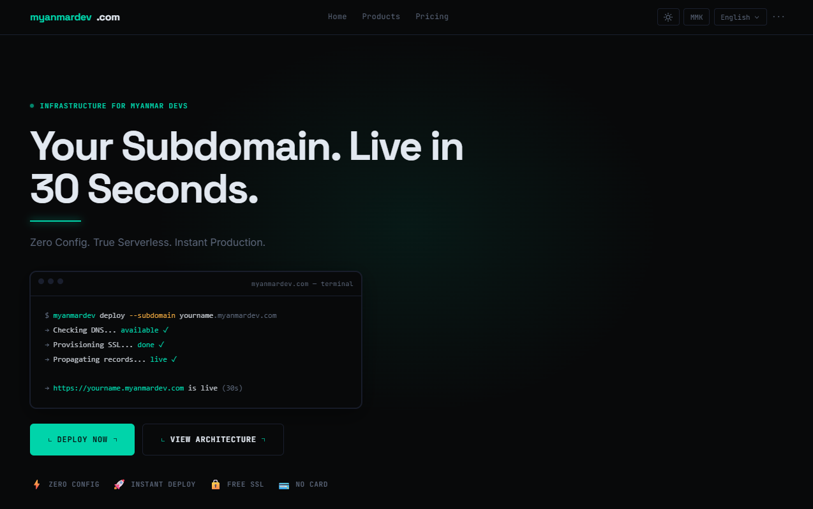

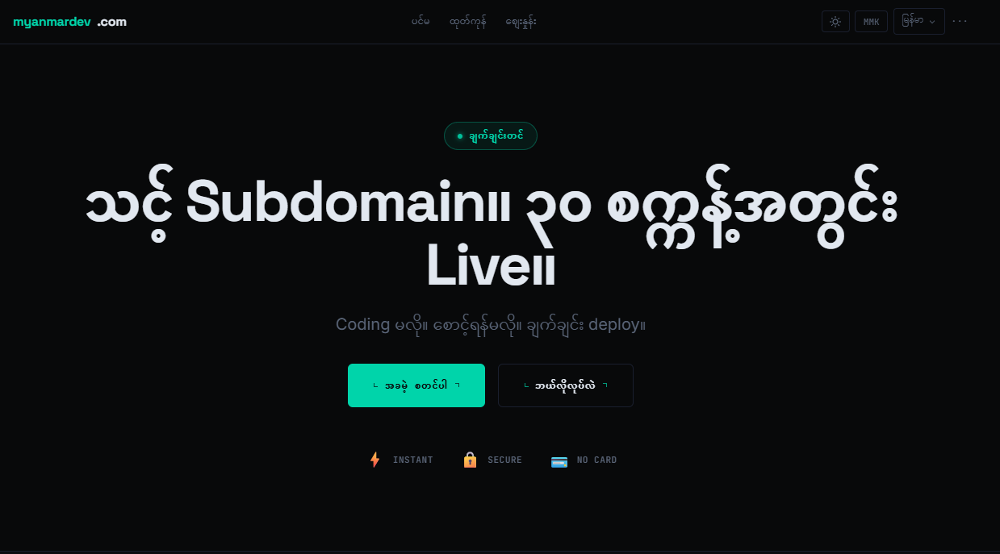

### Terminal-Style Hero

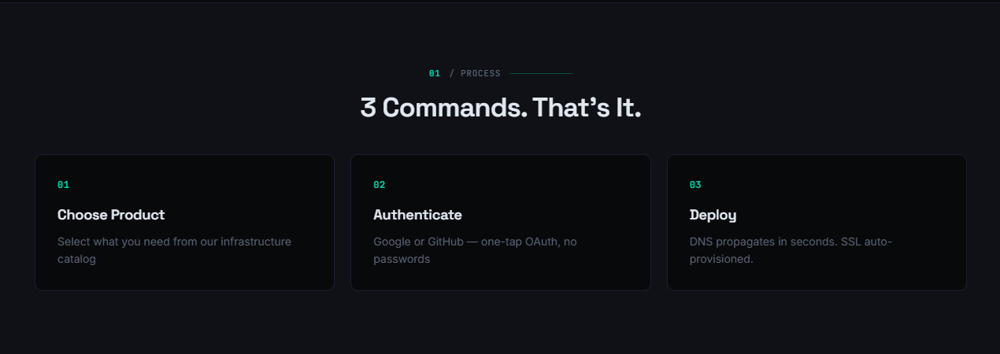

### Product Showcase

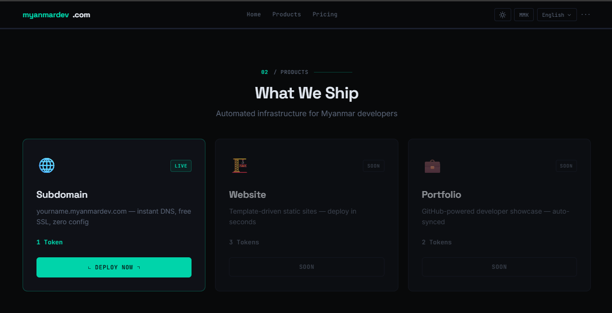

### Subdomain Availability Check

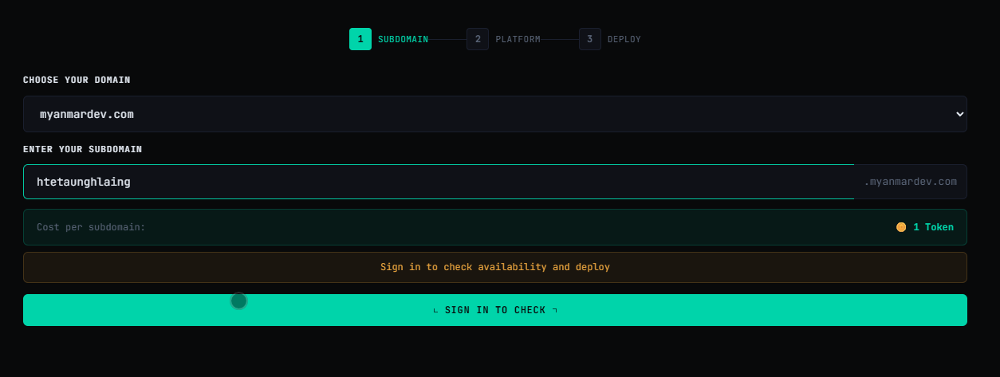

### Available Domains

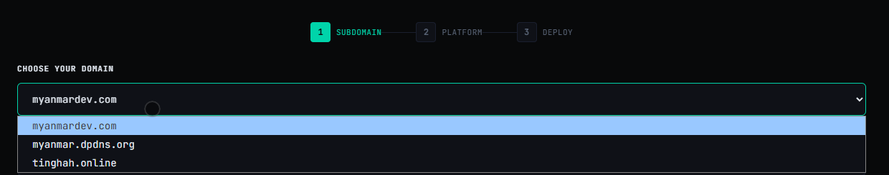

### Token Purchase & Redeem

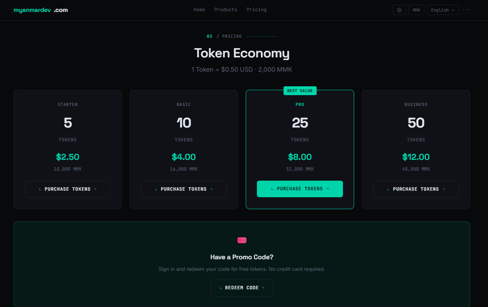

### Product Roadmap

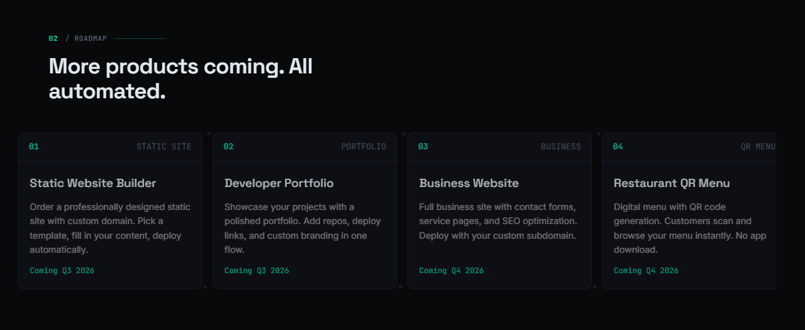

### Cloudflare Worker (DNS API)

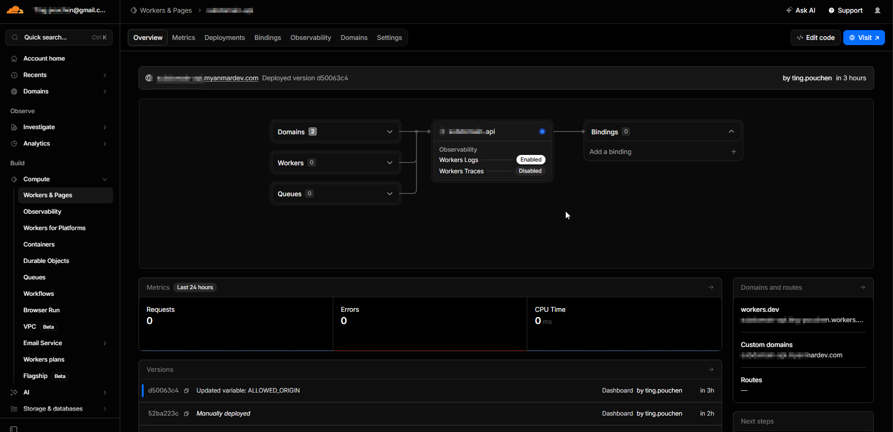

### Domain Management

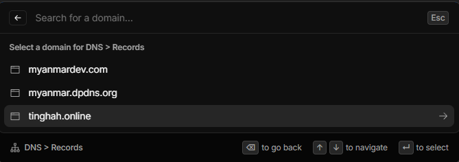

### DNS Records

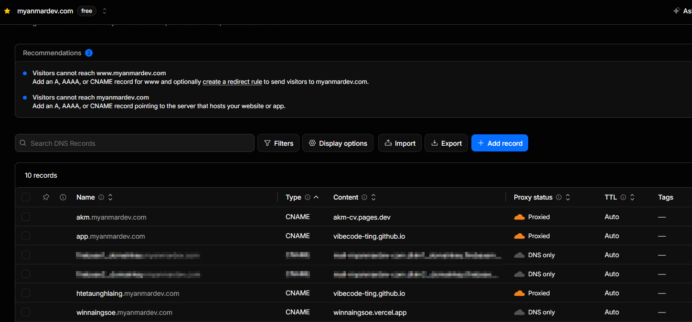

---

## Features

- **Guest-First Experience** — Browse products, pricing, and subdomain builder without signing in
- **Auth Gateway** — Elegant sign-in modal appears only on high-intent actions (deploy, purchase, redeem)
- **Dual Authentication** — Sign in with Google or GitHub via Firebase Auth
- **Token Economy** — Universal currency across all products; buy tokens, spend on any service
- **Redeem Code System** — Promotional codes that grant free tokens (one use per user per code)
- **User Dashboard** — Avatar, token balance, order history, and account details in the nav bar
- **Subdomain Builder** — Automated DNS record creation via Cloudflare API with live status
- **Dual Currency Pricing** — USD + MMK (Myanmar Kyat) with clear token-to-cost matrix
- **Bilingual i18n** — Full English and Burmese language support with client-side switching
- **Admin Scripts** — CLI tools for managing users, tokens, orders, and promo codes
- **Terminal-Grade UI** — Premium dark-mode developer aesthetic with Space Grotesk + JetBrains Mono

## Tech Stack

| Layer | Technology |
|-------|-----------|
| Frontend | Astro 6 + React 19 |
| Styling | Tailwind CSS 4 |
| Auth & Database | Firebase (Auth + Firestore) |
| API Proxy | Cloudflare Worker (serverless) |
| DNS | Cloudflare API |
| Deployment | GitHub Pages (static) |

## Architecture

```
Browser → Astro (static) → React (interactive)
                ↓
        Firebase Auth (Google + GitHub)
                ↓
        Firestore (users, orders, redeemCodes)
                ↓
        Cloudflare Worker → Cloudflare DNS API
```

## Token Packages

| Package | Tokens | Price (USD) | MMK |
|---------|--------|-------------|-----|
| Starter | 5 | $2.50 | 10,000 |
| Basic | 10 | $4.00 | 16,000 |
| Pro | 25 | $8.00 | 32,000 |
| Business | 50 | $12.00 | 48,000 |

--

# **BUILDER Profile & QUOTES**
---
# **(霆)Htet Aung Hlaing_Ting**

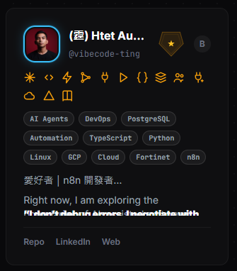

---
IT 工程師｜ERP 與 MES 系統支援｜自動化流程與跨國資料視覺化｜RPA 與 AI 工具愛好者｜n8n 開發者

Right now, I am exploring the boundaries of AI-assisted software engineering (vibe-coding).

> ### **"I don't debug errors. I negotiate with the LLM."**

> ### **"Vibe coding is 10% typing and 90% manifestation."**

> ### **"If it works, it works. Don't look under the hood."**

> ### **"If the vibe is right, the app just materializes."**

> ### **"Coding used to be chess. Now it is jazz."**

## License

This project is licensed under the [PolyForm Shield License 1.0.0](https://polyformproject.org/licenses/shield/1.0.0/).

You may use this software for any non-commercial purpose. Commercial use requires a separate license agreement. See the [full license text](https://polyformproject.org/licenses/shield/1.0.0/) for details.
